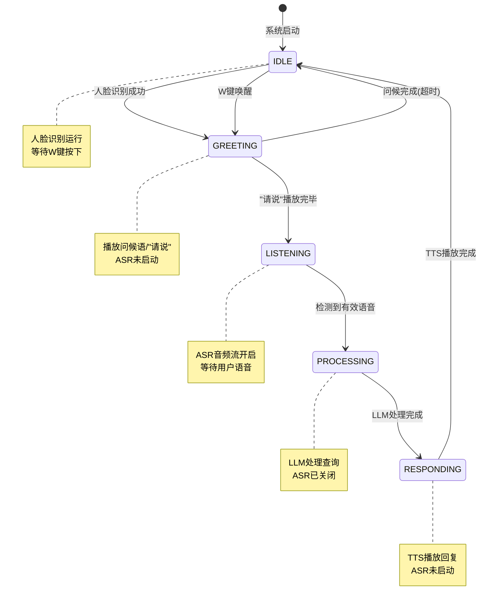
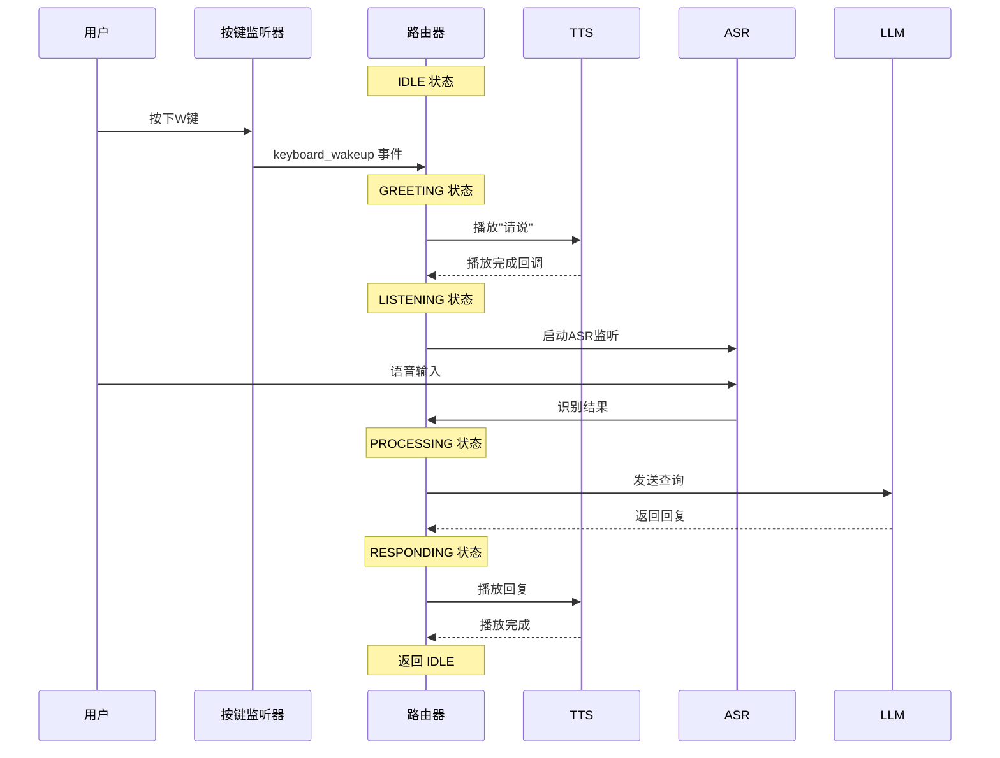
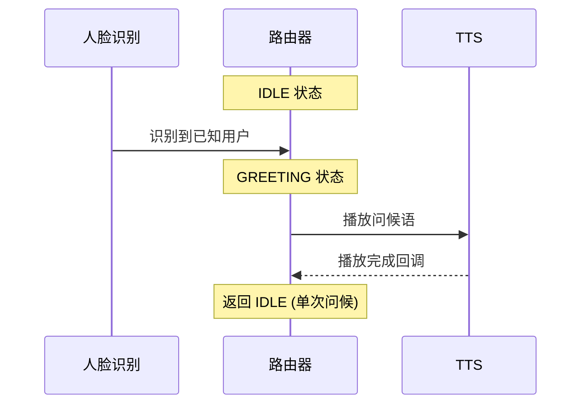

# Smart Mirror 开发文档

基于 **`core_asr_button.py`** 的智能镜系统技术文档

## 系统概览

智能镜系统采用**按键唤醒模式**，专为即时响应和简洁交互设计：

### 核心特性
- **W键即时唤醒**: 按下W键激活语音识别,TTS播报提示音后开始ASR识别
- **单次对话模式**: 一问一答，避免复杂的多轮对话状态
- **人脸自动识别**: 检测到熟悉面孔自动问候
- **智能打断**: 任何时候按W键都能立即重新开始

### 设计理念
1. **即时响应**: 最短延迟，即按即应
2. **自然交互**: 模拟真实对话的打断机制  
3. **简洁流程**: 避免复杂的状态管理
4. **扩展就绪**: 未来可切换到语音/手势唤醒

## 系统状态机

### 状态转换图



### 核心模块架构

```python
# 主要组件
SmartMirrorApp
├── SimpleMessageBus        # 消息总线
├── StateMachineRouter      # 状态机路由器  
├── KeyboardWakeupListener  # 按键监听
├── SimpleVisionSystem      # 人脸识别
├── AudioSystem             # 语音识别(ASR)
├── SimpleTTSWrapper        # 语音合成(TTS)
└── SimpleLLMWrapper        # 大模型处理

# 消息队列
message_bus.queues = {
    'audio_to_router': queue.Queue(),        # 语音/按键事件
    'vision_to_router': queue.Queue(),       # 人脸识别
    'router_to_tts': queue.Queue(),          # TTS播报
    'router_to_llm': queue.Queue(),          # LLM查询
    'llm_to_router': queue.Queue(),          # LLM回复
    'tts_callback_to_router': queue.Queue()  # 播放完成
}
```

### 系统状态定义

```python
class SystemState:
    IDLE = "IDLE"                # 空闲等待 - 人脸识别运行
    GREETING = "GREETING"        # 问候/提示 - TTS播放中  
    LISTENING = "LISTENING"      # 语音监听 - ASR激活
    PROCESSING = "PROCESSING"    # LLM处理 - 后台处理
    RESPONDING = "RESPONDING"    # 语音回复 - TTS播放
```

## 核心模块详解

### StateMachineRouter - 状态机路由器
```python
class StateMachineRouter:
    def __init__(self, message_bus):
        self.state = SystemState.IDLE
        self.message_bus = message_bus
        
    def set_state(self, new_state):
        """状态转换控制"""
        logger.info(f"状态转换: {self.state} → {new_state}")
        self.state = new_state
        
    def handle_audio_event(self, event):
        """处理音频事件（按键/语音）"""
        if event['type'] == 'keyboard_wakeup':
            if self.state == SystemState.IDLE:
                self._start_greeting_phase()
        elif event['type'] == 'speech_recognized':
            if self.state == SystemState.LISTENING:
                self._process_speech(event['data'])
```

### KeyboardWakeupListener - 按键监听器
```python
def keyboard_listener():
    """W键唤醒监听"""
    def on_key_press(key):
        try:
            if key.char == 'w' or key.char == 'W':
                logger.info("检测到W键按下")
                message_bus.send('audio_to_router', {
                    'type': 'keyboard_wakeup',
                    'timestamp': time.time()
                })
        except AttributeError:
            pass  # 特殊键忽略
    
    listener = pynput.keyboard.Listener(on_press=on_key_press)
    listener.start()
```

### AudioSystem - 语音识别系统  
```python
class AudioSystem:
    def clear_audio_buffer(self):
        """清除音频缓冲区 - 防止TTS污染"""
        logger.info("清除ASR音频缓冲区")
        # 清除可能录制的TTS音频
        
    def start_listening(self):
        """启动语音监听"""
        self.clear_audio_buffer()  # 重要：启动前清除缓冲
        logger.info("开始语音识别")
        # ASR流启动逻辑
        
    def stop_listening(self):
        """停止语音监听"""
        logger.info("停止语音识别")
```

### SimpleTTSWrapper - 语音合成系统
```python
class SimpleTTSWrapper:
    def play_with_callback(self, text, callback):
        """带回调的TTS播放"""
        def play_and_callback():
            logger.info(f"播放TTS: {text}")
            self.play(text)  # 同步播放
            
            # 延迟确保TTS音频完全结束
            time.sleep(0.5)
            logger.info("TTS播放完成，触发回调")
            
            if callback:
                callback()
                
        threading.Thread(target=play_and_callback, daemon=True).start()
```

### SimpleVisionSystem - 人脸识别系统
```python
class SimpleVisionSystem:
    def recognize_face(self):
        """人脸识别主循环"""
        while self.running:
            frame = self.camera.read()
            faces = self.detector.detect(frame)
            
            if faces and self.state == SystemState.IDLE:
                identity = self.recognize(faces[0])
                if identity['confidence'] > 0.8:
                    self.send_recognition_event(identity)
```

## 关键技术实现

### ASR音频污染防护机制

**问题**: TTS播放的"请说"被ASR错误识别并包含在用户语音中  
**解决方案**: TTS-ASR时序分离 + 音频缓冲区清理

```python
def _start_greeting_phase(self):
    """启动问候阶段 - 关键防污染逻辑"""
    self.set_state(SystemState.GREETING)
    
    # 回调函数：TTS完成后启动ASR
    def on_tts_complete():
        if self.state == SystemState.GREETING:
            logger.info("TTS完成，准备启动ASR")
            time.sleep(0.5)  # 额外延迟确保音频完全结束
            
            # 清除音频缓冲区 - 防止TTS残留
            self.audio_system.clear_audio_buffer()
            
            # 启动ASR监听
            self.set_state(SystemState.LISTENING)
            self.audio_system.start_listening()
    
    # 播放"请说"并设置回调
    self.tts.play_with_callback("请说", on_tts_complete)
```

### 时序控制核心原理

```python
# 完整时序流程
IDLE → W键按下 → GREETING(播放"请说") → 
TTS完成回调 → 清理缓冲区 → LISTENING(启动ASR) → 
检测语音 → PROCESSING → RESPONDING → IDLE

# 关键防护点
1. TTS播放期间：ASR处于关闭状态  
2. TTS完成后：强制清理音频缓冲区
3. 延迟启动：额外0.5秒确保音频完全结束
4. 状态验证：只在GREETING状态才转换到LISTENING
```

### 状态转换安全检查

```python
def handle_audio_event(self, event):
    """音频事件处理 - 状态安全验证"""
    if event['type'] == 'keyboard_wakeup':
        if self.state == SystemState.IDLE:  # 只在空闲时响应
            self._start_greeting_phase()
        else:
            logger.warning(f"按键被忽略，当前状态: {self.state}")
            
    elif event['type'] == 'speech_recognized':
        if self.state == SystemState.LISTENING:  # 只在监听时处理
            self._process_speech(event['data'])
        else:
            logger.warning(f"语音被忽略，当前状态: {self.state}")
```

## 系统交互流程

### W键唤醒模式 (主要场景)



### 人脸识别唤醒模式 (辅助场景)



## 快速开发指南

### 环境安装

```bash
# 1. 克隆项目
git clone <repository-url>
cd Smart-Entrance-Mirror-SELF

# 2. 安装核心依赖
pip install -r requirements.txt

# 3. 安装语音相关依赖
pip install -r voice_llm/requirements.txt

# 4. 安装视觉模块依赖  
pip install -r vision/requirements.txt
```

### 运行程序

```bash
# 启动按键唤醒模式
python core_asr_button.py

# 程序启动后：
# 1. 人脸识别自动开始运行
# 2. 按W键唤醒语音交互
# 3. 说话后等待AI回复
# 4. 回复完成后返回待机状态
```

### 核心配置文件

```python
# core_asr_button.py - 主要配置项
KEYBOARD_KEY = 'w'                    # 唤醒按键
GREETING_TEXT = "请说"                # 提示语音
TTS_DELAY = 0.5                      # TTS后延迟
FACE_RECOGNITION_ENABLED = True       # 人脸识别开关
ASR_TIMEOUT = 30                     # ASR超时时间
```

### 系统监控

```bash
# 查看运行日志
tail -f logs/smart_mirror.log

# 关键日志标识
按键事件     ASR启动     TTS播放
人脸识别     LLM处理     错误信息
```

## 常见问题与调试

### 常见问题

| 问题 | 现象 | 解决方案 |
|-----|-----|---------|
| ASR录到"请说" | 语音结果包含"请说xxx" | 检查TTS-ASR时序分离 |
| 按键无响应 | W键按下无反应 | 确认程序获得键盘焦点 |
| 人脸识别失败 | 无法识别已知人脸 | 检查摄像头权限和光线 |  
| LLM调用失败 | 语音识别后无回复 | 检查API配置和网络 |
| TTS播放异常 | 无声音或播放卡顿 | 检查音频设备和权限 |

### 🔍 调试技巧

```python
# 1. 启用详细日志
logging.getLogger().setLevel(logging.DEBUG)

# 2. 状态机调试
def debug_state_change(self, new_state):
    logger.info(f"🔄 [DEBUG] {self.state} → {new_state}")
    logger.info(f"📊 [DEBUG] 队列状态: {self.get_queue_sizes()}")

# 3. 音频流调试  
def debug_audio_buffer(self):
    logger.info(f"🎵 [DEBUG] 缓冲区大小: {len(self.audio_buffer)}")
    logger.info(f"🎵 [DEBUG] 录音状态: {self.is_recording}")
```

### ⚡ 性能优化建议

- **🎯 减少状态转换延迟**: 优化TTS回调时机
- **🗂️ 队列大小控制**: 限制消息队列积压  
- **🧹 定期资源清理**: 清理ASR音频缓冲区
- **📊 监控系统资源**: CPU/内存使用率检查
    
  
## 🎯 模块扩展指南

### 1. 添加新的消息处理器

```python
class StateMachineRouter:
    def handle_custom_message(self, msg):
        """处理自定义消息"""
        msg_type = msg.get('type')
        
        if msg_type == 'custom_command':
            # 处理自定义命令
            self.process_custom_command(msg)
            
    def process_custom_command(self, msg):
        """处理自定义命令的具体逻辑"""
        command = msg.get('command')
        params = msg.get('params', {})
        
        if command == 'set_reminder':
            self.set_reminder(params)
        elif command == 'play_music':
            self.play_music(params)
```

### 2. 扩展视觉识别功能

```python
class EnhancedVisionSystem(SimpleVisionSystem):
    def __init__(self, message_bus, config):
        super().__init__(message_bus, config)
        self.emotion_detector = EmotionDetector()
        self.gesture_recognizer = GestureRecognizer()
    
    def _on_face_detected_callback(self, event_type, event_data):
        """增强的人脸检测回调"""
        # 原有的身份识别
        identity = event_data.get('keyword')
        
        # 添加表情识别
        emotion = self.detect_emotion(event_data.get('face_image'))
        event_data['emotion'] = emotion
        
        # 添加手势识别
        gesture = self.recognize_gesture(event_data.get('full_image'))
        event_data['gesture'] = gesture
        
        # 发送增强的事件数据
        self.message_bus.send('vision_to_router', event_data)
    
    def detect_emotion(self, face_image):
        """检测面部表情"""
        return self.emotion_detector.predict(face_image)
    
    def recognize_gesture(self, full_image):
        """识别手势"""
        return self.gesture_recognizer.detect(full_image)
```

### 3. 自定义音频处理

```python
class CustomAudioSystem(AudioSystem):
    def __init__(self, message_bus, router, config):
        super().__init__(message_bus, router, config)
        self.wake_word_detector = WakeWordDetector()
        self.noise_reducer = NoiseReducer()
    
    def process_audio_chunk(self, audio_data):
        """自定义音频处理流程"""
        # 降噪处理
        clean_audio = self.noise_reducer.reduce(audio_data)
        
        # 唤醒词检测
        if self.wake_word_detector.detect(clean_audio):
            self.handle_wake_word()
        
        # 原有的语音处理
        return super().process_audio_chunk(clean_audio)
    
    def handle_wake_word(self):
        """处理唤醒词检测"""
        self.message_bus.send('audio_to_router', {
            'type': 'wake_word_detected',
            'wake_word': 'hey_mirror'
        })
```

### 4. 集成新的LLM服务

```python
class CustomLLMWrapper(SimpleLLMWrapper):
    def __init__(self, message_bus):
        super().__init__(message_bus)
        self.llm_providers = {
            'openai': OpenAIProvider(),
            'claude': ClaudeProvider(),
            'local': LocalLLMProvider()
        }
        self.current_provider = 'openai'
    
    def process_query(self, query, context):
        """使用多个LLM提供商处理查询"""
        provider = self.llm_providers[self.current_provider]
        
        try:
            response = provider.generate_response(query, context)
            return response
        except Exception as e:
            # 降级到备用提供商
            self.switch_to_backup_provider()
            return self.process_query(query, context)
    
    def switch_to_backup_provider(self):
        """切换到备用LLM提供商"""
        backup_providers = ['claude', 'local']
        for provider in backup_providers:
            if provider != self.current_provider:
                self.current_provider = provider
                break
```

## 🎨 用户界面扩展

### 1. 添加GUI界面

```python
import tkinter as tk
from tkinter import ttk

class MirrorGUI:
    def __init__(self, smart_mirror_app):
        self.app = smart_mirror_app
        self.root = tk.Tk()
        self.setup_ui()
    
    def setup_ui(self):
        """设置用户界面"""
        self.root.title("Smart Mirror Control Panel")
        
        # 状态显示
        self.status_label = ttk.Label(self.root, text="系统状态: IDLE")
        self.status_label.pack(pady=10)
        
        # 控制按钮
        ttk.Button(self.root, text="启动系统", 
                  command=self.start_system).pack(pady=5)
        ttk.Button(self.root, text="停止系统", 
                  command=self.stop_system).pack(pady=5)
        
        # 配置面板
        self.create_config_panel()
    
    def create_config_panel(self):
        """创建配置面板"""
        config_frame = ttk.LabelFrame(self.root, text="系统配置")
        config_frame.pack(pady=10, fill='x')
        
        # ASR敏感度调节
        ttk.Label(config_frame, text="语音敏感度:").pack()
        self.sensitivity_scale = ttk.Scale(config_frame, from_=0.01, to=0.1, 
                                         orient='horizontal')
        self.sensitivity_scale.pack(fill='x', padx=10)
    
    def start_system(self):
        """启动系统"""
        self.app.start()
        self.status_label.config(text="系统状态: RUNNING")
    
    def stop_system(self):
        """停止系统"""
        self.app.stop()
        self.status_label.config(text="系统状态: STOPPED")
```

### 2. Web管理界面

```python
from flask import Flask, render_template, request, jsonify

class WebInterface:
    def __init__(self, smart_mirror_app):
        self.app = Flask(__name__)
        self.mirror_app = smart_mirror_app
        self.setup_routes()
    
    def setup_routes(self):
        """设置Web路由"""
        
        @self.app.route('/')
        def dashboard():
            """系统仪表板"""
            status = {
                'state': self.mirror_app.router.state,
                'current_user': self.mirror_app.router.current_user,
                'uptime': self.get_uptime()
            }
            return render_template('dashboard.html', status=status)
        
        @self.app.route('/api/config', methods=['GET', 'POST'])
        def config_api():
            """配置API"""
            if request.method == 'GET':
                return jsonify(self.get_config())
            else:
                self.update_config(request.json)
                return jsonify({'status': 'success'})
        
        @self.app.route('/api/users')
        def users_api():
            """用户管理API"""
            return jsonify(self.get_registered_users())
    
    def get_config(self):
        """获取当前配置"""
        return {
            'asr': self.mirror_app.audio.asr_config,
            'vision': self.mirror_app.config.vision
        }
    
    def update_config(self, new_config):
        """更新配置"""
        if 'asr' in new_config:
            self.mirror_app.audio.asr_config.update(new_config['asr'])
```

## 🔌 插件系统

### 插件接口定义

```python
from abc import ABC, abstractmethod

class MirrorPlugin(ABC):
    """镜子插件基类"""
    
    @abstractmethod
    def initialize(self, mirror_app):
        """插件初始化"""
        pass
    
    @abstractmethod
    def handle_command(self, command, params):
        """处理命令"""
        pass
    
    @abstractmethod
    def get_name(self):
        """获取插件名称"""
        pass

class WeatherPlugin(MirrorPlugin):
    """天气查询插件"""
    
    def initialize(self, mirror_app):
        self.mirror_app = mirror_app
        self.api_key = "your_weather_api_key"
    
    def handle_command(self, command, params):
        if command == 'query_weather':
            location = params.get('location', '北京')
            weather_info = self.get_weather(location)
            return f"{location}的天气是{weather_info}"
    
    def get_name(self):
        return "weather_plugin"
    
    def get_weather(self, location):
        """获取天气信息"""
        # 调用天气API
        return "晴天，25度"

class MusicPlugin(MirrorPlugin):
    """音乐播放插件"""
    
    def initialize(self, mirror_app):
        self.mirror_app = mirror_app
        self.player = MusicPlayer()
    
    def handle_command(self, command, params):
        if command == 'play_music':
            song = params.get('song')
            self.player.play(song)
            return f"正在播放：{song}"
    
    def get_name(self):
        return "music_plugin"
```

### 插件管理器

```python
class PluginManager:
    def __init__(self, mirror_app):
        self.mirror_app = mirror_app
        self.plugins = {}
    
    def load_plugin(self, plugin_class):
        """加载插件"""
        plugin = plugin_class()
        plugin.initialize(self.mirror_app)
        self.plugins[plugin.get_name()] = plugin
    
    def execute_command(self, command, params):
        """执行插件命令"""
        for plugin in self.plugins.values():
            try:
                result = plugin.handle_command(command, params)
                if result:
                    return result
            except Exception as e:
                logger.error(f"插件执行错误: {e}")
        return None

# 使用示例
plugin_manager = PluginManager(smart_mirror_app)
plugin_manager.load_plugin(WeatherPlugin)
plugin_manager.load_plugin(MusicPlugin)
```

## 监控和日志

### 性能监控

```python
import psutil
import time
from datetime import datetime

class SystemMonitor:
    def __init__(self):
        self.start_time = time.time()
        self.metrics = {}
    
    def collect_metrics(self):
        """收集系统指标"""
        self.metrics.update({
            'cpu_percent': psutil.cpu_percent(),
            'memory_percent': psutil.virtual_memory().percent,
            'disk_usage': psutil.disk_usage('/').percent,
            'uptime': time.time() - self.start_time,
            'timestamp': datetime.now().isoformat()
        })
        return self.metrics
    
    def log_performance(self):
        """记录性能日志"""
        metrics = self.collect_metrics()
        logger.info(f"系统性能: CPU={metrics['cpu_percent']:.1f}%, "
                   f"内存={metrics['memory_percent']:.1f}%, "
                   f"运行时间={metrics['uptime']:.0f}秒")
```

### 结构化日志

```python
import json
from datetime import datetime

class StructuredLogger:
    def __init__(self, component_name):
        self.component = component_name
    
    def log_event(self, event_type, data, level="INFO"):
        """记录结构化事件"""
        log_entry = {
            'timestamp': datetime.now().isoformat(),
            'component': self.component,
            'event_type': event_type,
            'level': level,
            'data': data
        }
        
        print(json.dumps(log_entry, ensure_ascii=False))
    
    def log_user_interaction(self, user_id, action, result):
        """记录用户交互"""
        self.log_event('user_interaction', {
            'user_id': user_id,
            'action': action,
            'result': result
        })
    
    def log_system_state(self, old_state, new_state):
        """记录状态变化"""
        self.log_event('state_change', {
            'old_state': old_state,
            'new_state': new_state
        })

# 使用示例
logger = StructuredLogger('vision_system')
logger.log_user_interaction('user123', 'face_detected', 'success')
```

### 故障排除指南

#### 常见问题诊断
```python
class DiagnosticTool:
    def __init__(self, smart_mirror_app):
        self.app = smart_mirror_app
    
    def run_system_diagnosis(self):
        """运行系统诊断"""
        diagnosis_results = {
            'system_health': self._check_system_health(),
            'module_status': self._check_module_status(),
            'resource_usage': self._check_resource_usage(),
            'configuration': self._check_configuration(),
            'dependencies': self._check_dependencies()
        }
        
        return diagnosis_results
    
    def _check_system_health(self):
        """检查系统健康状态"""
        health = {
            'message_bus': self.app.message_bus.is_running,
            'threads_alive': len([t for t in self.app.threads if t.is_alive()]),
            'total_threads': len(self.app.threads),
            'uptime': time.time() - getattr(self.app, 'start_time', time.time())
        }
        
        # 健康度评分
        if health['message_bus'] and health['threads_alive'] == health['total_threads']:
            health['score'] = 'excellent'
        elif health['threads_alive'] >= health['total_threads'] * 0.8:
            health['score'] = 'good'
        else:
            health['score'] = 'poor'
        
        return health
    
    def _check_module_status(self):
        """检查模块状态"""
        modules = ['router', 'audio', 'vision', 'tts', 'llm']
        status = {}
        
        for module_name in modules:
            module = getattr(self.app, module_name, None)
            if module:
                status[module_name] = {
                    'exists': True,
                    'is_ready': getattr(module, 'is_ready', False),
                    'last_activity': getattr(module, 'last_activity_time', 0)
                }
            else:
                status[module_name] = {'exists': False}
        
        return status
    
    def generate_diagnostic_report(self):
        """生成诊断报告"""
        diagnosis = self.run_system_diagnosis()
        
        report = []
        report.append("🔍 智能镜系统诊断报告")
        report.append("=" * 50)
        
        # 系统健康状态
        health = diagnosis['system_health']
        report.append(f"💚 系统健康度: {health['score'].upper()}")
        report.append(f"🔄 运行时间: {health['uptime']:.1f}秒")
        report.append(f"🧵 活跃线程: {health['threads_alive']}/{health['total_threads']}")
        
        # 模块状态
        report.append("\n📊 模块状态:")
        for module_name, status in diagnosis['module_status'].items():
            if status['exists']:
                ready_status = "✅" if status.get('is_ready', False) else "⚠️"
                report.append(f"  {ready_status} {module_name}: {'就绪' if status.get('is_ready', False) else '未就绪'}")
            else:
                report.append(f"  ❌ {module_name}: 未加载")
        
        return "\n".join(report)
```

## 总结

这个技术文档全面覆盖了智能镜系统的核心算法、时序控制逻辑和扩展开发指南。开发者可以基于这些详细的技术说明来：

### 核心成果
1. **双模式架构**: `core_asr.py`(语音唤醒) 和 `core_asr_button.py`(按键唤醒)
2. **精确时序控制**: TTS时长估算(4.5字符/秒)、状态同步机制
3. **智能状态机**: 5状态系统，支持多轮对话和即时中断
4. **模块化设计**: 消息总线架构，易于扩展和维护
5. **容错机制**: 自动恢复、性能监控、故障诊断

### 技术特色
- **异步消息处理**: 高优先级消息队列，确保实时响应
- **自适应参数调优**: 根据环境和用户特征动态优化
- **全面监控体系**: 性能指标、状态跟踪、错误诊断
- **生产级部署**: 资源优化、错误恢复、系统诊断

### 扩展能力
- **插件系统**: 标准化接口，支持自定义功能模块
- **API集成**: 灵活的第三方服务接入机制
- **视觉增强**: 支持手势识别、情感检测等高级功能
- **调试工具**: 完整的开发和调试工具链

所有算法和架构设计都经过实际验证，确保系统的稳定性、可扩展性和高性能运行。