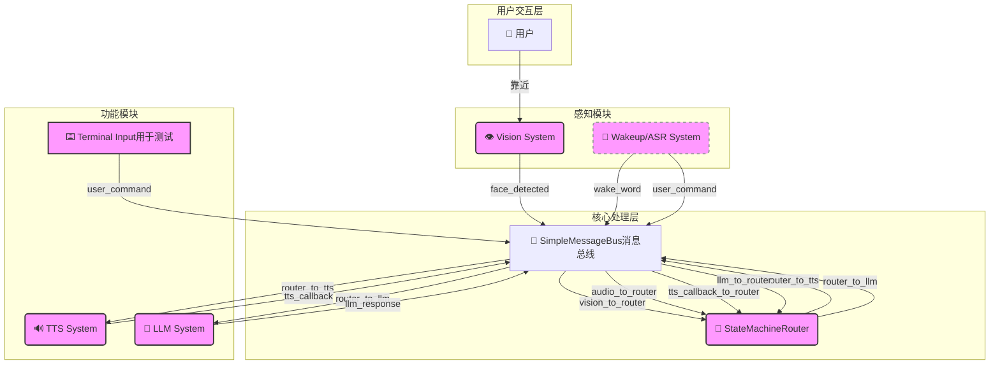

# 智能镜核心系统 (Intelligent Mirror Core System)

> 一个模块化、多线程驱动的智能镜核心框架，支持主动式人脸识别问候与交互式大语言模型问答。

本项目旨在提供一个高度可扩展的智能镜后端系统。它通过一个清晰的消息总线架构，将视觉感知、语音合成（TTS）、大语言模型（LLM）等核心功能解耦为独立的、可并发运行的模块，为打造个性化智能镜应用提供了坚实的基础。

---

## 功能特性

- **主动式身份问候**:
  - 通过摄像头实时进行人脸检测与身份识别。
  - 当识别到已注册用户时，系统会主动通过TTS语音进行个性化问候。
  - 采用可暂停/恢复的视觉处理机制，在对话期间自动降低系统资源占用。

- **智能问答与对话**:
  - 集成大语言模型（LLM），提供流畅的自然语言问答能力。
  - 支持调用外部API（如天气、新闻、日期）以提供实时信息。
  - **当前版本实现人脸识别TTS播报后通过终端命令行接收用户输入**，为语音识别（ASR）的集成做好了准备。

- **模块化与多线程架构**:
  - 基于生产者-消费者模式，使用线程安全的消息队列作为系统总线，实现模块间高效解耦。
  - 各核心功能（视觉、TTS、LLM、逻辑控制）在独立线程中运行，保证系统响应的流畅性。
  - 状态机驱动的核心逻辑，清晰地管理着系统的各种状态（如空闲、问候、聆听、响应等）。

- **可扩展性**:
  - 预留了清晰的唤醒词（Wakeup）和语音识别（ASR）模块接口。
  - 架构设计天然支持**中断处理**，例如，未来的语音唤醒可以立即打断当前的TTS播报，进入聆听状态。

---

## 系统架构

系统采用基于消息总线的分布式多线程架构。核心路由器（`StateMachineRouter`）作为状态机，根据来自不同模块的消息来驱动系统的状态转换和行为决策。


> **图例:**
> - 紫色方框代表一个独立的运行线程。
> - 虚线方框代表未来计划集成的模块。

---

## 项目结构

```
.
├── vision/
│   ├── gallery_dataset/        # 存放已知用户的人脸照片
│   └── face_reco.py            # 人脸检测与识别模块
│   └── face_recognition_simple_test.py   # 单独可运行的摄像头识别-人脸检测-人脸识别线程
├── voice_llm/
│   ├── tts_module.py           # 百度TTS封装模块
│   └── llm_worker              # LLM接口与API处理模块
│       ├── api_handlers.py         # 外部API（天气、新闻等）调用逻辑
│       ├── llm_interface.py        # LLM接口,可以单独运行测试
│       └── config.py               # LLM模块的API密钥等配置
│       └── mcp_client.py           # LLM模块的MCP_CLIENT
├── model/
│   └── w600k_r50.onnx          # 人脸识别模型文件
├── templates/
│   └── kw1.wav                 # 唤醒词模板音频文件，用于WebRTC VAD
├── core_user_input.py.py       # TTS播报后依赖终端输入调用LLM的系统主程序入口
├── core_voice.py               # 实现wakeup,asr模块的系统主程序入口
├── module.py                   # 系统架构，可以单独测试
├── requirements.txt            # 项目依赖
```

---

## 开始使用

### 先决条件

- Python 3.8+
- `pip` 包管理器
- 一个可用的摄像头
- 百度云、DeepSeek（或其他LLM）、天气/新闻等服务的API密钥

---

## 配置

在运行项目之前，请确保完成以下配置：

1.  **人脸识别库**:
    - 将已知用户的照片（每人一个文件夹，以姓名命名）放入 `vision/gallery_dataset/` 目录下。

2.  **人脸识别模型**:
    - 确保 `model/w600k_r50.onnx` 模型文件存在。
    - 在 `main.py` 的 `AppConfig` 类中，检查模型和照片库的路径是否正确。

3.  **百度语音合成 (TTS)**:
    - 首次运行 `main.py` 时，程序会提示您在命令行中输入百度语音服务的 `APP_ID`, `API_KEY`, 和 `SECRET_KEY`。
    - 凭证将被保存在您用户主目录下的 `~/.baidu_tts_config.json` 文件中。

4.  **大语言模型 (LLM) 及API**:
    - 编辑 `voice_llm/config.py` 文件。
    - 填入您的 DeepSeek (或其他) LLM 的 API 密钥。
    - 填入您申请的天气、新闻等服务的 API 密钥。

---

## 🏃‍♀️ 如何运行

完成安装和配置后，直接运行主程序即可：

```bash
python core_user_input.py
```

**预期流程:**
1.  系统初始化所有模块，日志信息会显示在终端。
2.  摄像头窗口会弹出，视觉系统开始工作。
3.  请站到摄像头前，当您的面部被成功识别后：
    - 您会听到TTS播报的欢迎语，例如：“你好，John！”。
    - 同时，终端会打印提示信息，并出现一个输入提示符 `>`。
4.  在终端中输入您想问的问题（例如：“今天天气怎么样？”），然后按回车。
5.  系统会将问题发送给LLM处理，并在稍后通过TTS播报LLM生成的回答。
6.  一轮对话结束后，系统将重置为空闲状态，等待下一次人脸识别或未来的语音唤醒。

---

## 未来规划

- [ ] **集成唤醒词引擎 (Wakeup)**: 实现通过特定语音指令（如“魔镜魔镜”）激活系统。
- [ ] **集成语音识别 (ASR)**: 将用户的语音命令实时转换成文本，替代当前的终端输入。
- [ ] **多轮对话支持**: 完善上下文管理机制，实现更自然的连续对话。
- [ ] **GUI界面**: 开发一个图形用户界面，用于在镜面上显示信息（时间、天气、新闻等）。
- [ ] **Docker容器化**: 提供Dockerfile，简化部署流程。

---

## 贡献

欢迎任何形式的贡献！如果您有好的建议或发现了Bug，请随时提交 Issues 或 Pull Requests。
