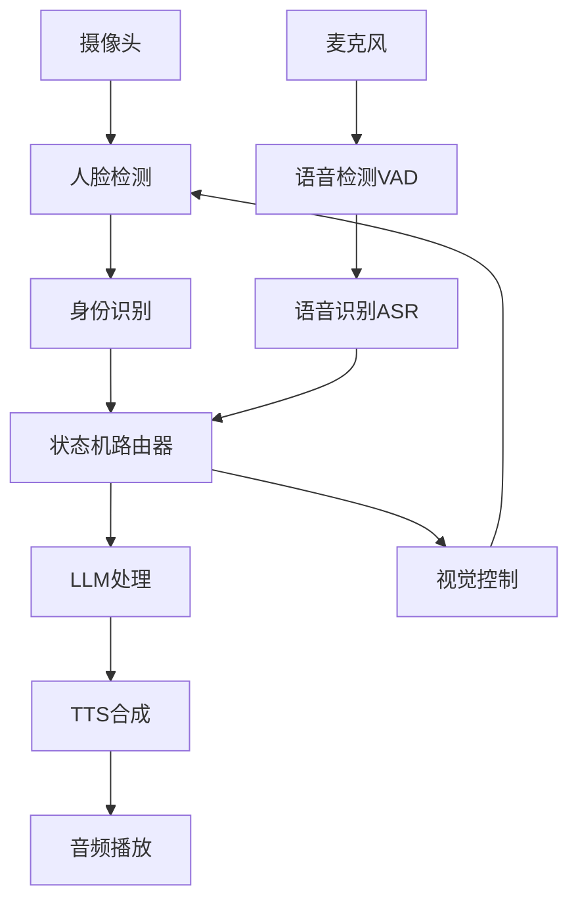

# 🪞 Smart Entrance Mirror - 智能入口镜

一个基于深度学习的智能镜系统，具备人脸识别、语音交互和AI助手功能。当用户走近镜子时，系统能够自动识别身份并提供个性化的语音交互服务。

算法与控制逻辑详见开发文档


## demo视频链接
https://b23.tv/BDQ8geF

## 🌟 核心特性

- **🔍 实时人脸识别**: 基于ONNX模型的高效人脸识别系统
- **🎤 智能语音交互**: 集成FunASR语音识别和TTS语音合成
- **🧠 AI助手对话**: 支持自然语言对话和智能回复
- **⚡ 多线程架构**: 高性能的异步处理架构
- **🎛️ 灵活配置**: 可调整的语音检测参数和系统配置
- **📊 状态机管理**: 清晰的系统状态流转和控制

## 🏗️ 系统架构

### 核心组件

```
智能镜系统
├── 🎯 StateMachineRouter (状态机路由器)
│   ├── IDLE (空闲等待)
│   ├── GREETING (问候识别)
│   ├── LISTENING (语音监听)
│   ├── PROCESSING (处理请求)
│   └── RESPONDING (回复播报)
├── 👁️ Vision System (视觉系统)
│   ├── 实时人脸检测
│   ├── 人脸特征提取
│   └── 身份识别匹配
├── 🎤 Audio System (音频系统)
│   ├── 语音活动检测(VAD)
│   ├── 自动语音识别(ASR)
│   └── 智能噪音过滤
├── 🔊 TTS System (语音合成)
│   ├── 文本转语音
│   ├── 播放时长估算
│   └── 音频播放控制
└── 🧠 LLM System (大语言模型)
    ├── 自然语言理解
    ├── 智能对话生成
    └── 上下文记忆
```

### 数据流图


```mermaid
graph TB
    A[摄像头] --> B[人脸检测]
    B --> C[身份识别]
    C --> D[状态机路由器]
    
    E[麦克风] --> F[语音检测VAD]
    F --> G[语音识别ASR]
    G --> D
    
    D --> H[LLM处理]
    H --> I[TTS合成]
    I --> J[音频播放]
    
    D --> K[视觉控制]
    K --> B
```

## 🛠️ 技术栈

### 深度学习框架
- **ONNX Runtime**: 人脸识别模型推理
- **FunASR**: 阿里达摩院语音识别模型
- **Buffalo_M**: 高精度人脸识别模型

### 核心依赖
- **Python 3.8+**: 主要开发语言
- **OpenCV**: 计算机视觉处理
- **PyAudio**: 音频采集和播放
- **asyncio**: 异步IO处理
- **threading**: 多线程并发

### AI模型
```python
# 人脸识别模型
model_path: "model/w600k_r50.onnx"  # Buffalo_M ONNX模型

# 语音识别模型  
model_dir: "speech_paraformer-large_asr_nat-zh-cn-16k-common-vocab8404-online"
```

## 📋 系统要求

### 硬件要求
- **CPU**: Intel i5 或 AMD Ryzen 5 以上
- **内存**: 至少 8GB RAM
- **摄像头**: USB摄像头或内置摄像头
- **麦克风**: USB麦克风或内置麦克风
- **音响**: 扬声器或耳机

### 软件要求
- **操作系统**: Windows 10/11, Linux, macOS
- **Python**: 3.8 或更高版本
- **显卡**: 支持CUDA的NVIDIA显卡 (可选，用于加速)

## 🚀 快速开始

### 1. 环境准备

```bash
# 克隆项目
git clone https://github.com/your-username/Smart-Entrance-Mirror-SELF.git
cd Smart-Entrance-Mirror-SELF

# 创建虚拟环境 (推荐)
conda create -n mirrorpy310 python=3.10
conda activate mirrorpy310

# 或使用 venv
python -m venv mirror_env
source mirror_env/bin/activate  # Linux/Mac
# mirror_env\Scripts\activate   # Windows
```

### 2. 安装依赖

```bash
# 安装核心依赖
pip install -r requirements.txt

# 安装额外依赖 (如需要)
pip install onnxruntime-gpu  # GPU加速版本
```

### 3. 模型下载

```bash
# 自动下载语音模型 (首次运行时)
python core_asr_ts.py
# 模型将下载到: ~/.cache/modelscope/hub/models/...

# 手动下载人脸模型 (如果需要)
wget https://github.com/deepinsight/insightface/releases/download/v0.7/buffalo_m.zip
unzip buffalo_m.zip -d model/
```

### 4. 人脸数据库准备

```bash
# 创建人脸图库
mkdir -p gallery_dataset/your_name
# 将个人照片放入对应文件夹
cp your_photos/* gallery_dataset/your_name/

# 支持的图片格式: .jpg, .jpeg, .png
# 建议每人 3-5 张不同角度的照片
```

### 5. 运行系统

```bash
# 启动智能镜系统
python core_asr_ts.py

# 查看详细日志
python core_asr_ts.py --verbose

# 使用自定义配置
python core_asr_ts.py --config custom_config.py
```

## ⚙️ 配置说明

### 主要配置文件
```python
# core_asr_ts.py 中的 AppConfig 类
class AppConfig:
    # 视觉配置
    vision = {
        'model_path': "model/w600k_r50.onnx",
        'gallery_dir': "gallery_dataset"
    }
    
    # ASR语音配置
    asr = {
        'model_dir': "path/to/asr/model",
        'amplitude_threshold': 0.03,      # 语音检测敏感度
        'confidence_required': 1,         # 连续检测次数
        'endpoint_silence_ms': 1500,      # 语音结束静音时长
        'debug_audio_threshold': 0.005,   # 调试日志阈值
    }
```

### 语音检测参数调优

```python
# 敏感模式 (安静环境)
asr_config = {
    'amplitude_threshold': 0.02,    # 更敏感
    'confidence_required': 1,       # 快速响应
    'endpoint_silence_ms': 1000,    # 更短等待
}

# 保守模式 (嘈杂环境)  
asr_config = {
    'amplitude_threshold': 0.05,    # 较不敏感
    'confidence_required': 3,       # 更稳定
    'endpoint_silence_ms': 2000,    # 更长等待
}
```

### 使用参数调整工具

```bash
# 运行ASR参数调整工具
python asr_tuning_tool.py

# 生成配置模板
python asr_tuning_tool.py --generate-config
```

## 🎯 使用流程

### 典型用户交互流程

1. **👤 用户接近**: 摄像头检测到人脸
2. **🔍 身份识别**: 系统识别用户身份
3. **👋 个性化问候**: "你好，张三！今天看起来不错。有什么可以帮您的吗？"
4. **🎤 语音等待**: 系统进入听音模式，等待用户语音指令
5. **🗣️ 用户说话**: "今天天气怎么样？"
6. **🧠 AI处理**: LLM理解并生成回复
7. **🔊 语音回复**: "今天晴天，温度25度，适合出行。"
8. **🔄 继续对话**: 可继续多轮对话
9. **⏰ 自动结束**: 无操作后自动返回待机状态

### 系统状态说明

| 状态 | 说明 | 视觉模块 | 音频模块 | 超时时间 |
|------|------|----------|----------|----------|
| IDLE | 空闲等待 | ✅ 激活 | ❌ 关闭 | 无限制 |
| GREETING | 问候中 | ❌ 暂停 | ❌ 关闭 | 动态计算 |
| LISTENING | 听音中 | ❌ 暂停 | ✅ 激活 | 25秒 |
| PROCESSING | 处理中 | ❌ 暂停 | ❌ 关闭 | 30秒 |
| RESPONDING | 回复中 | ❌ 暂停 | ❌ 关闭 | 动态计算 |

## 🔧 开发指南

### 项目结构

```
Smart-Entrance-Mirror-SELF/
├── 📄 core_asr_ts.py           # 主程序入口
├── 📄 requirements.txt         # Python依赖
├── 📁 voice_llm/              # 语音和LLM模块
│   ├── asr_service.py         # 语音识别服务
│   ├── tts_module.py          # 语音合成模块
│   └── llm_worker/            # LLM工作模块
├── 📁 vision/                 # 视觉处理模块
│   ├── face_reco.py           # 人脸识别核心
│   └── camera_and_recognition.py
├── 📁 model/                  # AI模型文件
│   └── w600k_r50.onnx         # 人脸识别模型
├── 📁 gallery_dataset/        # 人脸图库
│   ├── person1/               # 个人图片文件夹
│   ├── person2/
│   └── ...
└── 📁 tools/                  # 开发工具
    ├── asr_tuning_tool.py     # ASR参数调优
    └── test_timing_fix.py     # 时序测试
```

### 关键类说明

#### StateMachineRouter
- **作用**: 系统核心状态机，管理所有模块协调
- **主要方法**:
  - `handle_vision_message()`: 处理人脸识别消息
  - `handle_audio_message()`: 处理语音输入消息
  - `handle_tts_callback()`: 处理TTS完成回调
  - `reset_to_idle()`: 重置系统到空闲状态

#### AudioSystem  
- **作用**: 语音采集和识别处理
- **核心算法**: VAD + 幅度检测 + 连续性验证
- **主要参数**: 
  - `amplitude_threshold`: 音频信号强度阈值
  - `confidence_required`: 连续检测次数要求

#### SimpleVisionSystem
- **作用**: 人脸检测和识别
- **核心算法**: ONNX模型推理 + 特征匹配
- **主要方法**:
  - `pause()`: 暂停人脸检测
  - `resume()`: 恢复人脸检测

### 添加新功能

#### 添加新的语音命令(规则库匹配)

```python
# 在 handle_audio_message 中添加命令识别
def handle_audio_message(self, msg):
    if msg_type == 'user_command':
        text = msg.get('text', '').strip()
        
        # 添加特定命令处理
        if '播放音乐' in text:
            self.handle_music_command(text)
        elif '设置提醒' in text:
            self.handle_reminder_command(text)
```

#### 扩展人脸识别功能

```python
# 在 handle_vision_message 中添加新逻辑
def handle_vision_message(self, msg):
    identity = msg.get('keyword')
    
    # 添加访客处理
    if identity == "stranger":
        self.handle_visitor_detection(msg)
    
    # 添加表情识别
    emotion = msg.get('emotion', 'neutral')
    self.handle_emotion_response(identity, emotion)
```

## 🐛 故障排除

### 常见问题

#### 1. 人脸识别不准确
```bash
# 检查摄像头
python -c "import cv2; cap=cv2.VideoCapture(0); print('Camera OK' if cap.read()[0] else 'Camera Error')"

# 检查光照条件
# 确保光线充足，避免逆光

# 重新训练人脸库
rm -rf gallery_dataset/.cache
python core_asr_ts.py  # 重新初始化
```

#### 2. 语音识别失效
```bash
# 检查麦克风
python -c "import pyaudio; p=pyaudio.PyAudio(); print('Microphone devices:'); [print(f'{i}: {p.get_device_info_by_index(i)}') for i in range(p.get_device_count())]"

# 调整语音敏感度
python asr_tuning_tool.py  # 使用调优工具

# 检查环境噪音
# 建议在安静环境下使用
```

#### 3. 系统卡顿或崩溃
```bash
# 检查系统资源
htop  # Linux
# Task Manager  # Windows

# 减少并发负载
# 调整 AppConfig 中的参数
# 考虑使用GPU加速
```

#### 4. TTS播放问题
```bash
# 检查音频设备
python -c "import pygame; pygame.mixer.init(); print('Audio OK')"

# 检查TTS模块
python -c "from voice_llm.tts_module import TTSModule; print('TTS Module OK')"
```

### 日志分析

```bash
# 查看详细日志
python core_asr_ts.py 2>&1 | tee system.log

# 过滤特定组件日志
grep "🎤" system.log  # 音频相关
grep "👁️" system.log  # 视觉相关  
grep "🔊" system.log  # TTS相关
grep "🧠" system.log  # LLM相关
```

## 🔒 约束条件和注意事项

### 隐私保护
- **本地处理**: 人脸数据仅在本地存储和处理
- **数据安全**: 不上传个人生物特征数据
- **访问控制**: 建议设置访问权限和使用场景限制

### 使用限制
- **环境光照**: 需要适当的光照条件进行人脸识别
- **网络连接**: LLM服务可能需要网络连接
- **计算资源**: 实时处理需要足够的CPU/GPU资源
- **音频环境**: 建议在相对安静的环境下使用

### 法律合规
- **用户同意**: 使用前需获得用户明确同意
- **数据留存**: 遵循当地数据保护法规
- **使用场景**: 仅限于授权场景下使用

## 🤝 贡献指南

我们欢迎所有形式的贡献！

### 贡献类型
- 🐛 Bug 修复
- ✨ 新功能开发  
- 📚 文档改进
- 🎨 UI/UX 优化
- ⚡ 性能优化

### 开发流程
1. Fork 项目到个人仓库
2. 创建功能分支: `git checkout -b feature/new-feature`
3. 提交更改: `git commit -m 'Add new feature'`
4. 推送分支: `git push origin feature/new-feature`
5. 创建 Pull Request

### 代码规范
- 遵循 PEP 8 Python 代码规范
- 添加必要的注释和文档字符串
- 编写单元测试覆盖新功能
- 确保向后兼容性

## 📄 许可证

本项目采用 MIT 许可证。详见 [LICENSE](LICENSE) 文件。

## 🙏 致谢

- [InsightFace](https://github.com/deepinsight/insightface) - 人脸识别模型
- [FunASR](https://github.com/alibaba-damo-academy/FunASR) - 语音识别框架
- [OpenCV](https://opencv.org/) - 计算机视觉库
- 所有贡献者和社区成员

## 📞 联系方式

- **项目主页**: [GitHub Repository](https://github.com/your-username/Smart-Entrance-Mirror-SELF)
- **问题报告**: [GitHub Issues](https://github.com/your-username/Smart-Entrance-Mirror-SELF/issues)
- **功能请求**: [GitHub Discussions](https://github.com/your-username/Smart-Entrance-Mirror-SELF/discussions)

---

<div align="center">

**⭐ 如果这个项目对您有帮助，请给我们一个星标！**

Made with ❤️ by Smart Mirror Team

</div>
