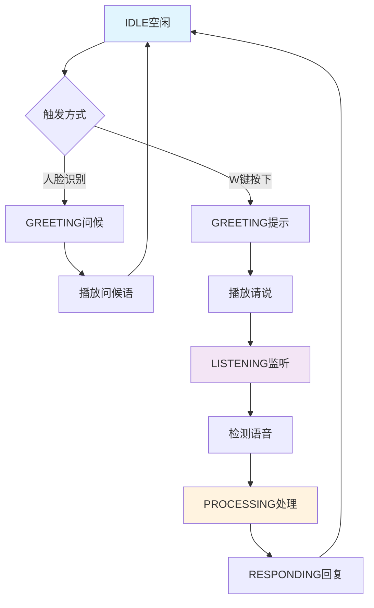

# Smart Entrance Mirror - 智能入口镜

一个基于深度学习的智能镜系统，采用**按键唤醒模式**，具备人脸识别、语音交互和AI助手功能。系统支持W键即时唤醒语音交互，提供自然流畅的单轮对话体验。

> 详细的算法与控制逻辑请参见 [DEVELOPMENT.md](DEVELOPMENT.md) 开发文档


## 演示视频
**完整系统演示**: https://b23.tv/BDQ8geF  
**demo所用设备**: Intel(R) Core(TM) Ultra 9 185H Intel64 Family 6 Model 170 Stepping 4 

## 核心特性

- **按键唤醒**: W键即时唤醒，无需等待，随时可用
- **智能人脸识别**: 基于Buffalo_M ONNX模型的高精度识别
- **流畅语音交互**: FunASR + TTS，支持自然语音对话
- **AI智能助手**: 集成大语言模型，智能理解与回复
- **音频防污染**: TTS-ASR时序分离，避免系统提示音干扰
- **状态机控制**: 5状态精确管理，确保交互流程清晰
- **即时响应**: 优化的单轮对话模式，快速响应用户需求

## 系统架构 (按键唤醒模式)

### 主程序: core_asr_button.py

```
SmartMirrorApp (按键唤醒版)
├── KeyboardWakeupListener    # W键监听器
├── StateMachineRouter        # 5状态流程控制
│   ├── IDLE (空闲等待)       # 人脸识别 + 按键监听
│   ├── GREETING (问候中)     # TTS播放"请说"
│   ├── LISTENING (语音监听)  # ASR语音识别激活
│   ├── PROCESSING (AI处理)   # LLM理解与生成
│   └── RESPONDING (语音回复) # TTS播放回复
├── SimpleVisionSystem        # 人脸识别模块
├── AudioSystem               # FunASR语音识别
├── SimpleTTSWrapper          # 百度TTS语音合成
└── SimpleLLMWrapper          # OpenAI/本地大模型
```

### 交互流程


```mermaid
flowchart TD
    A[IDLE空闲] --> B{触发方式}
    B -->|人脸识别| C[GREETING问候]
    B -->|W键按下| D[GREETING提示]
    
    C --> E[播放问候语]
    D --> F[播放请说]
    
    E --> A
    F --> G[LISTENING监听]
    
    G --> H[检测语音]
    H --> I[PROCESSING处理]
    I --> J[RESPONDING回复]
    J --> A
    
    style A fill:#e1f5fe
    style G fill:#f3e5f5
    style I fill:#fff3e0
```

## 技术栈

### AI模型
- **语音识别**: FunASR (阿里达摩院) - Paraformer大模型
- **人脸识别**: Buffalo_M (InsightFace) - w600k_r50.onnx
- **语音合成**: 百度TTS API
- **大语言模型**: OpenAI GPT / 本地模型支持

### 核心技术
- **Python 3.8+**: 主要开发语言
- **ONNX Runtime**: AI模型推理引擎
- **OpenCV**: 计算机视觉处理
- **PyAudio**: 音频采集和播放
- **pynput**: 全局按键监听
- **Threading**: 多线程异步架构

### 架构设计
- **消息总线**: 队列式模块通信
- **状态机**: 5状态精确流程控制  
- **防污染机制**: TTS-ASR时序分离
- **即时响应**: 按键唤醒零延迟设计

## 系统要求

### 硬件要求
- **CPU**: Intel i5 或 AMD Ryzen 5 以上
- **内存**: 至少 8GB RAM
- **摄像头**: USB摄像头或内置摄像头
- **麦克风**: USB麦克风或内置麦克风
- **音响**: 扬声器或耳机

### 软件要求
- **操作系统**: Windows 10/11, Linux, macOS
- **Python**: 3.8 或更高版本
- **显卡**: 支持CUDA的NVIDIA显卡 (可选，用于加速)

## 快速开始

### 1. 环境准备

```bash
# 克隆项目
git clone https://github.com/your-username/Smart-Entrance-Mirror-SELF.git
cd Smart-Entrance-Mirror-SELF

# 创建虚拟环境 (推荐)
conda create -n mirrorpy310 python=3.10
conda activate mirrorpy310

# 或使用 venv
python -m venv mirror_env
source mirror_env/bin/activate  # Linux/Mac
# mirror_env\Scripts\activate   # Windows
```

### 2. 安装依赖

```bash
# 安装核心依赖
pip install -r requirements.txt

# 安装语音模块依赖
pip install -r voice_llm/requirements.txt

# 安装视觉模块依赖
pip install -r vision/requirements.txt

# 可选: GPU加速支持
pip install onnxruntime-gpu
```

### 3. 人脸数据库准备

```bash
# 创建个人人脸图库 (重要!)
mkdir gallery_dataset/your_name
# 将个人照片放入对应文件夹 (3-5张不同角度)
copy your_photos/* gallery_dataset/your_name/

# 支持格式: .jpg, .jpeg, .png
# 提示: 照片质量影响识别准确率
```

### 4. 启动系统

```bash
# 启动按键唤醒模式
python core_asr_button.py

# 系统启动后看到以下提示即表示成功:
# 所有模块线程已启动
# 按键唤醒监听器已启动，监听按键: ['w']
# 视觉模块已标记为 Ready
```

### 5. 使用方法

```bash
# 基本操作
1. 走近镜子 -> 自动人脸识别并问候
2. 按W键 -> 听到"请说"后开始说话  
3. 说出问题 -> AI理解并语音回复
4. 继续按W键可开始新对话

# 高级操作  
Ctrl+C  # 退出系统
```

## 配置说明

### 核心配置 (core_asr_button.py)

```python
class AppConfig:
    # ASR语音识别配置 (关键参数)
    asr = {
        'amplitude_threshold': 0.025,     # 语音敏感度 (降低=更敏感)
        'confidence_required': 2,         # 连续检测次数要求  
        'endpoint_silence_ms': 1200,      # 语音结束等待时间(ms)
    }
    
    # 按键唤醒配置
    keyboard = {
        'enable_keyboard_wakeup': True,   # 启用按键唤醒
        'wakeup_keys': ['w'],             # 唤醒按键 (默认W键)
    }
    
    # 视觉识别配置  
    vision = {
        'model_path': "model/w600k_r50.onnx",
        'gallery_dir': "gallery_dataset"
    }
```

### 参数调优建议

| 环境类型 | amplitude_threshold | confidence_required | endpoint_silence_ms | 说明 |
|---------|-------------------|-------------------|-------------------|------|
| 安静环境 | 0.02 | 1-2 | 1000ms | 快速响应，高敏感度 |
| 办公室 | 0.025 | 2-3 | 1200ms | 平衡模式 (推荐) |
| 嘈杂环境 | 0.05 | 3-4 | 2000ms | 抗干扰，稳定优先 |

## 使用说明

### 交互模式

**即时唤醒模式** (主要使用方式)
```
1. 按W键 → 听到"请说" → 说出问题 → AI回复 → 返回待机
```

**自动问候模式** (辅助功能)  
```
1. 走近镜子 → 人脸识别 → 问候语播放 → 返回待机
```

### 核心特点

- **即时打断**: 任何时候按W键都能立即开始新对话
- **单轮对话**: 一问一答模式，避免复杂状态管理  
- **音频隔离**: TTS播放期间ASR自动关闭，避免干扰
- **智能超时**: 无操作自动返回待机状态

### 系统状态说明

| 状态 | 说明 | 视觉模块 | 音频模块 | 超时时间 |
|------|------|----------|----------|----------|
| IDLE | 空闲等待 | 激活 | 关闭 | 无限制 |
| GREETING | 问候中 | 暂停 | 关闭 | 动态计算 |
| LISTENING | 听音中 | 暂停 | 激活 | 25秒 |
| PROCESSING | 处理中 | 暂停 | 关闭 | 30秒 |
| RESPONDING | 回复中 | 暂停 | 关闭 | 动态计算 |

## 开发指南

### 项目结构

```
Smart-Entrance-Mirror-SELF/
├── core_asr_button.py       # 主程序入口 (按键唤醒版)
├── requirements.txt         # Python依赖
├── voice_llm/              # 语音和LLM模块
│   ├── asr_service.py         # 语音识别服务
│   ├── tts_module.py          # 语音合成模块
│   └── llm_worker/            # LLM工作模块
├── vision/                 # 视觉处理模块
│   ├── face_reco.py           # 人脸识别核心
│   └── camera_and_recognition.py
├── model/                  # AI模型文件
│   └── w600k_r50.onnx         # 人脸识别模型
├── gallery_dataset/        # 人脸图库
│   ├── person1/               # 个人图片文件夹
│   ├── person2/
│   └── ...
└── tools/                  # 开发工具
    ├── asr_tuning_tool.py     # ASR参数调优
    └── test_timing_fix.py     # 时序测试
```

## 系统状态监控

### 状态转换表

| 当前状态 | 触发事件 | 目标状态 | 说明 |
|---------|----------|----------|------|
| IDLE | 人脸识别成功 | GREETING | 播放个性化问候 |
| IDLE | W键按下 | GREETING | 播放"请说"提示 |
| GREETING | 问候播放完毕 | IDLE | 返回待机状态 |
| GREETING | "请说"播放完毕 | LISTENING | 启动语音识别 |
| LISTENING | 检测到语音 | PROCESSING | 发送给LLM处理 |
| PROCESSING | LLM返回结果 | RESPONDING | 播放AI回复 |
| RESPONDING | 回复播放完毕 | IDLE | 对话结束 |

### 运行状态检查

```bash
# 系统启动成功标志
所有模块线程已启动
按键唤醒监听器已启动，监听按键: ['w']  
视觉模块已标记为 Ready
音频模块启动 (仅LISTENING状态ASR模式)
TTS模块初始化完成，监听播报任务...

# 正常工作日志示例
检测到W键按下
状态转换: IDLE -> GREETING  
播放TTS: 请说
状态转换: GREETING -> LISTENING
用户语音: '今天天气怎么样'
LLM 回复: '今天是晴天，温度25度...'
```
## 故障排除指南

### 常见问题快速诊断

| 问题现象 | 可能原因 | 解决方案 | 优先级 |
|---------|----------|----------|-------|
| W键无响应 | 程序未获得键盘焦点 | 点击程序窗口或以管理员运行 | 高 |
| ASR识别不准 | 麦克风权限/环境噪音 | 检查权限，调整敏感度参数 | 中 |
| 人脸识别失败 | 光照不足/摄像头问题 | 改善光照，检查摄像头状态 | 中 |
| AI无回复 | API配置/网络问题 | 检查LLM API配置和网络 | 中 |
| TTS无声音 | 音频设备/权限问题 | 检查音频设备和系统权限 | 中 |

### 诊断命令

```bash
# 一键检测系统状态
python -c "
import cv2, pyaudio, sys
# 检查摄像头
cap = cv2.VideoCapture(0)
cam_ok = cap.read()[0]
cap.release()
# 检查音频
pa = pyaudio.PyAudio()
audio_devices = pa.get_device_count()
pa.terminate()
# 输出结果
print(f'摄像头: {'正常' if cam_ok else '异常'}')
print(f'音频设备: {audio_devices} 个设备')
print(f'Python: {sys.version.split()[0]}')
"

# 查看详细运行日志  
python core_asr_button.py > system.log 2>&1 &
tail -f system.log | grep -E "检测到|语音|视觉|播放|错误"
```

### 快速修复

```bash
# 重启相关服务 (Windows)
taskkill /f /im python.exe  # 强制关闭Python进程
python core_asr_button.py   # 重新启动

# 清理缓存数据
del /q gallery_dataset\.cache\*  # 清理人脸缓存
rmdir /s gallery_dataset\.cache  # 删除缓存目录
```

#### 3. 系统卡顿或崩溃
```bash
# 检查系统资源
htop  # Linux
# Task Manager  # Windows

# 减少并发负载
# 调整 AppConfig 中的参数
# 考虑使用GPU加速
```

#### 4. TTS播放问题
```bash
# 检查音频设备
python -c "import pygame; pygame.mixer.init(); print('Audio OK')"

# 检查TTS模块
python -c "from voice_llm.tts_module import TTSModule; print('TTS Module OK')"
```

### 日志分析

```bash
# 查看详细日志
python core_asr_button.py 2>&1 | tee system.log

# 过滤特定组件日志
grep "音频" system.log  # 音频相关
grep "视觉" system.log  # 视觉相关  
grep "TTS" system.log  # TTS相关
grep "LLM" system.log  # LLM相关
```

## 开发与扩展

### 项目结构 (按键唤醒版)

```
core_asr_button.py          # 主程序 - 按键唤醒专用版
├── SmartMirrorApp            # 应用主类
├── StateMachineRouter        # 5状态流程控制  
├── KeyboardWakeupListener    # W键监听器
├── AudioSystem              # FunASR语音识别
├── SimpleVisionSystem       # 人脸识别 
├── SimpleTTSWrapper         # TTS语音合成
└── SimpleLLMWrapper         # 大模型接口

相关模块文件
├── voice_llm/               # 语音AI模块
├── vision/                  # 视觉处理模块  
├── gallery_dataset/         # 人脸数据库
└── tools/                   # 开发工具
```

### 扩展功能建议

- **语音唤醒**: 替代按键触发，支持"小助手"等唤醒词
- **手势识别**: 挥手或特定手势触发交互
- **表情分析**: 根据用户情绪调整回复风格
- **智能家居**: 集成IoT设备控制功能
- **多用户模式**: 支持家庭成员个性化配置

##  使用约束与安全

### 隐私保护
- **本地优先**: 人脸特征数据仅本地存储处理
- **数据不外传**: 不上传个人生物特征到云端
- **访问控制**: 建议配置设备使用权限管理

### 使用限制
- **环境要求**: 充足光照条件 (避免逆光/暗光)
- **网络依赖**: LLM服务需要稳定网络连接
- **性能要求**: 推荐8GB+内存，i5+CPU
- **音频环境**: 相对安静环境获得最佳体验

### 合规使用
- **用户授权**: 获得明确使用同意后部署
- **📝 数据管理**: 遵循当地个人数据保护法规  
- **🎯 场景限制**: 仅在授权的私人/办公场景使用

## 🤝 社区贡献

### 💡 贡献方式
- **🐛 问题报告**: [GitHub Issues](https://github.com/alvinwet-sys/Smart-Entrance-Mirror/issues)
- **✨ 功能建议**: [Discussions](https://github.com/alvinwet-sys/Smart-Entrance-Mirror/discussions)  
- **📝 代码贡献**: Fork → 开发 → Pull Request
- **📚 文档完善**: 改进使用说明和开发文档

### 🛠️ 开发规范
```bash
# 开发环境搭建
git clone https://github.com/alvinwet-sys/Smart-Entrance-Mirror.git
cd Smart-Entrance-Mirror
git checkout -b feature/your-feature-name

# 代码规范检查
flake8 core_asr_button.py
black core_asr_button.py --check

# 提交规范
git commit -m "feat: 添加新的语音唤醒功能"
git commit -m "fix: 修复ASR音频污染问题"  
git commit -m "docs: 更新用户使用指南"
```

---

## 许可协议

本项目采用 **MIT 许可证**，允许自由使用、修改和分发。详见 [LICENSE](LICENSE) 文件。

## 致谢

感谢以下开源项目和贡献者:

| 项目 | 作用 | 链接 |
|-----|------|------|
| **InsightFace** | 高精度人脸识别模型 | [GitHub](https://github.com/deepinsight/insightface) |
| **FunASR** | 阿里达摩院语音识别 | [GitHub](https://github.com/alibaba-damo-academy/FunASR) |
| **OpenCV** | 计算机视觉基础库 | [官网](https://opencv.org/) |
| **pynput** | 跨平台输入控制 | [PyPI](https://pypi.org/project/pynput/) |


## 联系与支持

| 类型 | 渠道 | 说明 |
|------|------|------|
| **项目主页** | [GitHub Repository](https://github.com/alvinwet-sys/Smart-Entrance-Mirror) | 源码、发布版本 |
| **问题报告** | [GitHub Issues](https://github.com/alvinwet-sys/Smart-Entrance-Mirror/issues) | Bug报告、功能建议 |
| **技术讨论** | [GitHub Discussions](https://github.com/alvinwet-sys/Smart-Entrance-Mirror/discussions) | 使用交流、开发讨论 |
| **演示视频** | [哔哩哔哩](https://b23.tv/BDQ8geF) | 系统功能演示 |

---

<div align="center">

**如果这个项目对您有帮助，请给我们一个 Star！**


**Made with by Smart Mirror Team**

*专注于按键唤醒模式的智能交互体验 | v2.0*

</div>
